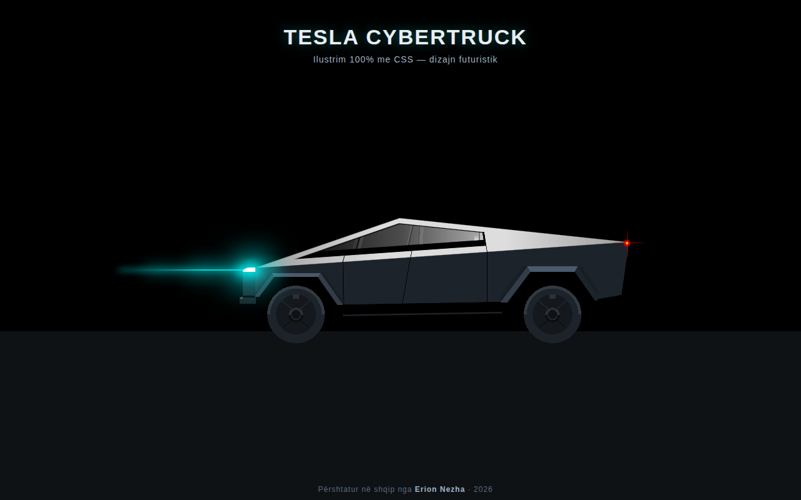

# Tesla Cybertruck



## Përshkrimi

Faqe prezantuese **Tesla Cybertruck** me dizajn futuristik — makina është vizatuar **100% me CSS**, pa asnjë imazh. Krijuar nga Erion Nezha.

Demo ilustron formën ikonike këndore të Cybertruck me ndriçim neoni: dritat LED përpara, rrotat, dhe siluetën e çeliktë inox — gjithçka e ndërtuar me gradientë CSS.

> **Shënim:** Kjo faqe është një demo kreative. Tesla dhe Cybertruck janë marka tregtare të Tesla, Inc.

## Demo live

👉 https://erionnezha.github.io/Tesla-Cybertruck/

## Si ta hapësh lokalisht

Shkarko ose klono repo-n dhe hap `index.html` në shfletues — nuk ka nevojë për server apo instalime:

```bash
git clone https://github.com/ErionNezha/Tesla-Cybertruck.git
cd Tesla-Cybertruck
# hap index.html në shfletues
```

## Teknologjitë

- HTML5
- CSS3 (ilustrimi i plotë i Cybertruck është ndërtuar vetëm me gradientë CSS)

## Licenca

Të gjitha të drejtat e rezervuara © 2026 Erion Nezha — shiko [LICENSE](LICENSE).

---

# Tesla Cybertruck (English)

## Description

A **Tesla Cybertruck** showcase page with a futuristic design — the truck is drawn **100% in CSS**, with no images. Created by Erion Nezha.

The demo renders the iconic angular shape of the Cybertruck with neon lighting: the LED light bar at the front, the wheels, and the stainless-steel silhouette — everything built from CSS gradients.

> **Note:** This is a creative demo. Tesla and Cybertruck are trademarks of Tesla, Inc.

## Live demo

👉 https://erionnezha.github.io/Tesla-Cybertruck/

## Open locally

Clone the repo and open `index.html` in a browser — no server or build step needed:

```bash
git clone https://github.com/ErionNezha/Tesla-Cybertruck.git
cd Tesla-Cybertruck
# open index.html in your browser
```

## Technologies

- HTML5
- CSS3 (the entire Cybertruck illustration is built purely from CSS gradients)

## License

All rights reserved © 2026 Erion Nezha — see [LICENSE](LICENSE).
